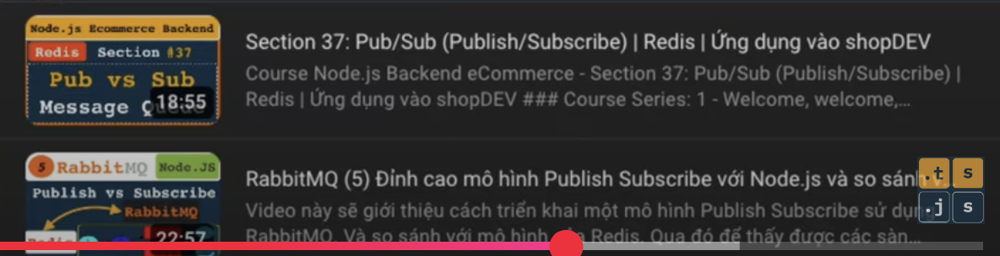

# Gouroutine

## Why we have goroutine print out everything if you set the time.sleep in function main?

1. **Without time.sleep**

   ```go
   package main

   import (
       "fmt"
       "time"
   )

   func main() { // goroutine

       fmt.Println("Starting...")

       ids := []int{1, 2, 3, 4, 5} // productIds

       start := time.Now()

       for _, id := range ids {
           go getProductByIdAPI(id) // detail product
       }

       // time.Sleep(1 * time.Second)

       fmt.Println("Finished...", time.Since(start))
   }

   func getProductByIdAPI(id int) {
       // go-func

       fmt.Println(">>> Data ProductId:", id)
       time.Sleep(time.Second * 1)

       // response data
   }

   OUTPUT

   Starting...
   >>> Data ProductId: 1
   Finished... 40.167µs
   >>> Data ProductId: 4

   ```

2. **With time.spleep**

   ```go
   package main

   import (
       "fmt"
       "time"
   )

   func main() { // goroutine

       fmt.Println("Starting...")

       ids := []int{1, 2, 3, 4, 5} // productIds

       start := time.Now()

       for _, id := range ids {
           go getProductByIdAPI(id) // detail product
       }

       // time.Sleep(1 * time.Second)

       fmt.Println("Finished...", time.Since(start))
   }

   func getProductByIdAPI(id int) {
       // go-func

       fmt.Println(">>> Data ProductId:", id)
       time.Sleep(time.Second * 1)

       // response data
   }

   OUTPUT

   Starting...
   >>> Data ProductId: 5
   >>> Data ProductId: 4
   >>> Data ProductId: 1
   >>> Data ProductId: 2
   >>> Data ProductId: 3
   Finished... 1.001127292s

   ```

### Explanation:

The `main()` function in Go is also a goroutine, referred to as the "main goroutine." If the main goroutine shuts down, it will terminate all other goroutines running within the program. For instance, in the following example:

If the main goroutine ends, the getProductByAPI goroutine (`go getProductByIdAPI(id)`) will also terminate.

To ensure the main goroutine waits for other goroutines to complete their tasks, we can use `time.Sleep()` in the main goroutine. However, this approach has a significant drawback: how can we determine the optimal duration for `time.Sleep()` to ensure it's sufficient but not excessively time-consuming?

The answer is simple: we can't predict exactly when other goroutines will finish their tasks.

To address this issue, Golang provides a more efficient solution: the `WaitGroup` feature.

### Waitgroup feature

```go

    package main

    import (
    "fmt"
    "time"
    )

    func main() { // goroutine

        fmt.Println("Starting...")
        var wg sync.WaitGroup // Tạo main worker (main goroutine) tạo bản công việc

        ids := []int{1, 2, 3, 4, 5} // productIds

        start := time.Now()

        for _, id := range ids {
            wg.Add(1) // Main worker add 1 công việc đã được giao vào bản công việc
            go getProductByIdAPI(id, &wg) // gửi bản công việc sang thằng worker khác (other goroutine)
            // ở đây main goroutine ghi liền 5 công việc và gửi liền 5 công việc luôn nhé mà 0 đợi từng công việc xong rồi mới làm cái tiếp theo
        }
        wg.Wait() // Sau khi gửi liền 5 công việc cho các worker khác, Main worker sẽ nhìn vào bản kết hoạch xem số lượng công việc đã về 0 chưa, nghĩa là tất là tất cả công việc đã hoàn thành chưa => Nếu chưa thì main worker ngồi đợi ở đây đến khi hoàn thành

        fmt.Println("Finished...", time.Since(start))

    }

    func getProductByIdAPI(id int) {
        // defer đơn giản chỉ là nó đưa command này xuống cuối cùng của function getProductByIdAPi
        defer wg.done() // sau khi làm việc xong thì worker (other goroutine) đảm nhận công viêc này sẽ xoá công việc được giao ra khỏi bản công việc - có thể nói là chấm công hoàn thành
        fmt.Println(">>> Data ProductId:", id)
        time.Sleep(time.Second * 1)

    }

    // OUTPUT
    Starting...
    >>> Data ProductId: 2
    >>> Data ProductId: 1
    >>> Data ProductId: 4
    >>> Data ProductId: 3
    >>> Data ProductId: 5
    Finished... 1.001088833s
```

- Sau khi run xong thì mình biết được thời gian hoàn thành các task là **1.001088833s**.

### Practical Example : Ví dụ thực tế

1. Without Goroutine => F\*\*CKING SLOW

   ```go
   package main

   import (
       "fmt"
       "io"
       "net/http"
       "time"
   )

   func main() { // goroutine

       fmt.Println("Starting...")
       ids := []int{1, 2, 3, 4, 5} // productIds

       start := time.Now()

       for _, id := range ids {

           getProductByIdAPI(id) // detail product
       }

       time.Sleep(1 * time.Second)

       fmt.Println("Finished...", time.Since(start))
   }

   func getProductByIdAPI(id int) {

       url := fmt.Sprintf("https://fakestoreapi.com/products/%d", id)

       resp, err := http.Get(url)
       if err != nil {
           return
       }

       defer resp.Body.Close()

       body, err := io.ReadAll(resp.Body)
       if err != nil {
           return
       }

       fmt.Printf(">>> Data ProductId: %d: %s\n", id, string(body))

   }

   //-------------OUTPUT-------------------

   Starting...
   >>> Data ProductId: 1: {"id":1,"title":"Fjallraven - Foldsack No. 1 Backpack, Fits 15 Laptops","price":109.95,"description":"Your perfect pack for everyday use and walks in the forest. Stash your laptop (up to 15 inches) in the padded sleeve, your everyday","category":"men's clothing","image":"https://fakestoreapi.com/img/81fPKd-2AYL._AC_SL1500_.jpg","rating":{"rate":3.9,"count":120}}
   >>> Data ProductId: 2: {"id":2,"title":"Mens Casual Premium Slim Fit T-Shirts ","price":22.3,"description":"Slim-fitting style, contrast raglan long sleeve, three-button henley placket, light weight & soft fabric for breathable and comfortable wearing. And Solid stitched shirts with round neck made for durability and a great fit for casual fashion wear and diehard baseball fans. The Henley style round neckline includes a three-button placket.","category":"men's clothing","image":"https://fakestoreapi.com/img/71-3HjGNDUL._AC_SY879._SX._UX._SY._UY_.jpg","rating":{"rate":4.1,"count":259}}
   >>> Data ProductId: 3: {"id":3,"title":"Mens Cotton Jacket","price":55.99,"description":"great outerwear jackets for Spring/Autumn/Winter, suitable for many occasions, such as working, hiking, camping, mountain/rock climbing, cycling, traveling or other outdoors. Good gift choice for you or your family member. A warm hearted love to Father, husband or son in this thanksgiving or Christmas Day.","category":"men's clothing","image":"https://fakestoreapi.com/img/71li-ujtlUL._AC_UX679_.jpg","rating":{"rate":4.7,"count":500}}
   >>> Data ProductId: 4: {"id":4,"title":"Mens Casual Slim Fit","price":15.99,"description":"The color could be slightly different between on the screen and in practice. / Please note that body builds vary by person, therefore, detailed size information should be reviewed below on the product description.","category":"men's clothing","image":"https://fakestoreapi.com/img/71YXzeOuslL._AC_UY879_.jpg","rating":{"rate":2.1,"count":430}}
   >>> Data ProductId: 5: {"id":5,"title":"John Hardy Women's Legends Naga Gold & Silver Dragon Station Chain Bracelet","price":695,"description":"From our Legends Collection, the Naga was inspired by the mythical water dragon that protects the ocean's pearl. Wear facing inward to be bestowed with love and abundance, or outward for protection.","category":"jewelery","image":"https://fakestoreapi.com/img/71pWzhdJNwL._AC_UL640_QL65_ML3_.jpg","rating":{"rate":4.6,"count":400}}


   Finished... 3.594448375s
   ```

2. With Goroutine => F\*\*CKING FAST

   ```go
   package main

   import (
       "fmt"
       "io"
       "net/http"
       "sync"
       "time"
   )

   func main() { // goroutine

       fmt.Println("Starting...")
       wg := sync.WaitGroup{}
       ids := []int{1, 2, 3, 4, 5} // productIds

       start := time.Now()

       for _, id := range ids {
           wg.Add(1)
           go getProductByIdAPI(id, &wg) // detail product
       }

       time.Sleep(1 * time.Second)

       fmt.Println("Finished...", time.Since(start))
   }

   func getProductByIdAPI(id int, wg *sync.WaitGroup) {
       defer wg.Done()

       url := fmt.Sprintf("https://fakestoreapi.com/products/%d", id)

       resp, err := http.Get(url)
       if err != nil {
           return
       }
       defer resp.Body.Close()
       body, err := io.ReadAll(resp.Body)
       if err != nil {
           return
       }
       fmt.Printf(">>> Data ProductId: %d: %s\n", id, string(body))

   }

   // OUTPUT

   Starting...
   >>> Data ProductId: 5: {"id":5,"title":"John Hardy Women's Legends Naga Gold & Silver Dragon Station Chain Bracelet","price":695,"description":"From our Legends Collection, the Naga was inspired by the mythical water dragon that protects the ocean's pearl. Wear facing inward to be bestowed with love and abundance, or outward for protection.","category":"jewelery","image":"https://fakestoreapi.com/img/71pWzhdJNwL._AC_UL640_QL65_ML3_.jpg","rating":{"rate":4.6,"count":400}}
   >>> Data ProductId: 2: {"id":2,"title":"Mens Casual Premium Slim Fit T-Shirts ","price":22.3,"description":"Slim-fitting style, contrast raglan long sleeve, three-button henley placket, light weight & soft fabric for breathable and comfortable wearing. And Solid stitched shirts with round neck made for durability and a great fit for casual fashion wear and diehard baseball fans. The Henley style round neckline includes a three-button placket.","category":"men's clothing","image":"https://fakestoreapi.com/img/71-3HjGNDUL._AC_SY879._SX._UX._SY._UY_.jpg","rating":{"rate":4.1,"count":259}}
   >>> Data ProductId: 1: {"id":1,"title":"Fjallraven - Foldsack No. 1 Backpack, Fits 15 Laptops","price":109.95,"description":"Your perfect pack for everyday use and walks in the forest. Stash your laptop (up to 15 inches) in the padded sleeve, your everyday","category":"men's clothing","image":"https://fakestoreapi.com/img/81fPKd-2AYL._AC_SL1500_.jpg","rating":{"rate":3.9,"count":120}}
   >>> Data ProductId: 4: {"id":4,"title":"Mens Casual Slim Fit","price":15.99,"description":"The color could be slightly different between on the screen and in practice. / Please note that body builds vary by person, therefore, detailed size information should be reviewed below on the product description.","category":"men's clothing","image":"https://fakestoreapi.com/img/71YXzeOuslL._AC_UY879_.jpg","rating":{"rate":2.1,"count":430}}
   >>> Data ProductId: 3: {"id":3,"title":"Mens Cotton Jacket","price":55.99,"description":"great outerwear jackets for Spring/Autumn/Winter, suitable for many occasions, such as working, hiking, camping, mountain/rock climbing, cycling, traveling or other outdoors. Good gift choice for you or your family member. A warm hearted love to Father, husband or son in this thanksgiving or Christmas Day.","category":"men's clothing","image":"https://fakestoreapi.com/img/71li-ujtlUL._AC_UX679_.jpg","rating":{"rate":4.7,"count":500}}

   Finished... 1.001142375s
   ```

### Channel feature

1. Channel đóng vai trò làm cổng giao tiếp giữa 2 thằng Goroutine nói chuyện với nhau
2. Goroutine giống như publish and subscribe trong redis
3. Remember to close the channel to signal the receiver that it can stop working. Otherwise, it will wait forever.

```go
package main

import (
	"fmt"
	"time"
)

type Message struct {
	orderId int
	Title   string
	Price   int
}

// Push data to channel
func Publisher(channel chan<- Message, orders []Message) {
	for _, order := range orders {
		fmt.Printf("Publisher: %s\n", order.orderId)
		channel <- order
		time.Sleep(time.Second * 1)
	}
	close(channel)
}

// Receive data from channel
func Subscriber(channel <-chan Message, userName string) {
	// Always use "loop" to receive data from channel
	for msg := range channel {
		fmt.Printf("userName %s :: Order %d :: Title:: %s :: Price %d\n", userName, msg.orderId, msg.Title, msg.Price)
		time.Sleep(time.Second * 1)
	}
}

func main() {
	//1. Create a channel that hold the type of Message
	orderChannel := make(chan Message)

	orders := []Message{
		{orderId: 1, Title: "Book", Price: 10},
		{orderId: 2, Title: "Pen", Price: 2},
		{orderId: 3, Title: "Notebook", Price: 5},
	}
	go Publisher(orderChannel, orders)
	go Subscriber(orderChannel, "Truong vu")
	fmt.Println("End pub sub..")
}
// -------------OUTPUT-------------------
End pub sub..

```

In this situation, the main goroutine ends too quickly, preventing the other goroutines from processing data. To fix this, we need to use WaitGroup to keep track of task that goroutine do

### SOLUTION

```go
package main

import (
	"fmt"
	"sync"
	"time"
)

type Message struct {
	orderId int
	Title   string
	Price   int
}

// Push data to channel
func Publisher(channel chan<- Message, orders []Message, wg *sync.WaitGroup) {
	defer wg.Done() // Decrease 1 when finish
	for _, order := range orders {
		fmt.Printf("Publisher: %d\n", order.orderId)
		channel <- order
		time.Sleep(time.Second * 1)
	}
	close(channel) // Close channel after finish push data
}

// Receive data from channel
func Subscriber(channel <-chan Message, userName string, wg *sync.WaitGroup) {
	// Always use "loop" to receive data from channel
	defer wg.Done() // Decrease 1 when finish
	for msg := range channel {
		fmt.Printf("userName %s :: Order %d :: Title:: %s :: Price %d\n", userName, msg.orderId, msg.Title, msg.Price)
		time.Sleep(time.Second * 1)
	}
}

func main() {
	//1. Create a channel that hold the type of Message
	orderChannel := make(chan Message)
	wg := sync.WaitGroup{}
	orders := []Message{
		{orderId: 1, Title: "Book", Price: 10},
		{orderId: 2, Title: "Pen", Price: 2},
		{orderId: 3, Title: "Notebook", Price: 5},
	}
	wg.Add(2) // Wait for 2 goroutines to finish it task
	go Publisher(orderChannel, orders, &wg)
	go Subscriber(orderChannel, "Truong vu", &wg)
	wg.Wait()
	fmt.Println("End pub sub..")
}

```

### This code here is wrong :

```go
package main

import (
	"fmt"
	"sync"
	"time"
)

type Message struct {
	orderId int
	Title   string
	Price   int
}

// Push data to channel
func Publisher(channel chan<- Message, orders []Message, wg *sync.WaitGroup) {
	for _, order := range orders {
		wg.Add(1) // Wait for 2 goroutines to finish it task
		fmt.Printf("Publisher: %d\n", order.orderId)
		channel <- order
		time.Sleep(time.Second * 1)
	}
	close(channel) // Close channel after finish push data
}

// Receive data from channel
func Subscriber(channel <-chan Message, userName string, wg *sync.WaitGroup) {
	// Always use "loop" to receive data from channel
	for msg := range channel {
		wg.Done() // Decrease 1 when finish
		fmt.Printf("userName %s :: Order %d :: Title:: %s :: Price %d\n", userName, msg.orderId, msg.Title, msg.Price)
		time.Sleep(time.Second * 1)
	}
}

func main() {
	//1. Create a channel that hold the type of Message
	orderChannel := make(chan Message, 3)
	wg := sync.WaitGroup{}
	orders := []Message{
		{orderId: 1, Title: "Book", Price: 10},
		{orderId: 2, Title: "Pen", Price: 2},
		{orderId: 3, Title: "Notebook", Price: 5},
	}
	go Publisher(orderChannel, orders, &wg)
	go Subscriber(orderChannel, "Truong vu", &wg)
	wg.Wait()
	fmt.Println("End pub sub..")
}

```

=> Because Publisher and Subscribe is running concurrently => it may cause the problem that Subscriber function may call `wg.Done()` before the corresponding `wg.Add(1)` has been executed in the Publisher function => Cause race condition

1. If `wg.Done()` trigger before `wg.Add(1)` => The counter below zero => Operation shut down - panic

===> Khiến cho quá trình `wg.Add()` và `wg.Done()` được đồng bộ => Có nghĩa chúng ta tách phần add công việc `wd.Add(1)` ra khỏi function goroutine. Thì khi ấy task add công việc vào bản công việc sẽ xong trước hết rồi thì khi ấy việc mà chấm công muón run thế nào cũng được (không bị overlap hay race condition)

#### If one goroutine is listening to multiple channels, how does it decide which channel to prioritize or process first?

Let's say there is a situation where one person wants to buy a ticket to go home for the Tet festival, and another person wants to cancel their ticket. These two events happen simultaneously.

- Channel for buying a ticket
- Channel for canceling a ticket

My questions are:

1. How does the listening goroutine decide which channel to process first?
2. If the process of canceling the ticket encounters an error for some random reason, does it still proceed?

```go
package main

import (
	"fmt"
	"time"
)

type Message struct {
	orderId int
	Title   string
	Price   int
}

func buyTicket(buyChannel chan<- Message, buyOrders []Message) {
	for _, buyOrder := range buyOrders {
		time.Sleep(time.Second * 1)
		fmt.Printf("Buy order: %v\n", buyOrder.orderId)
		buyChannel <- buyOrder // Push order to buy channel
	}
	close(buyChannel)

}

func cancelTicket(cancelChannel chan<- string, cancelOrders []string) {
	for _, cancelOrder := range cancelOrders {
		time.Sleep(time.Second * 1)
		fmt.Printf("Cancel order: %v\n", cancelOrder)
		cancelChannel <- cancelOrder // Push order to cancel channel
	}
	close(cancelChannel)

}
func handleOrder(buyChannel <-chan Message, cancelChannel <-chan string) {
	for {
		buyOrder, orderOk := <-buyChannel
		if orderOk {
			fmt.Printf(" Buy Ticket: orderID %d - %s - %d\n", buyOrder.orderId, buyOrder.Title, buyOrder.Price)
		} else {
			fmt.Println("Buy channel is closed ")
			break
		}
		cancelOrder, cancelOk := <-cancelChannel
		if cancelOk {
			fmt.Printf(" Cancel Ticket: orderID %s\n", cancelOrder)
		} else {
			fmt.Println("Cancel channel is closed ")
			break

		}

	}
}

// Push data to channel

func main() {
	//1. Create a channel that hold the type of Message
	buyChannel := make(chan Message)
	cancelChannel := make(chan string)
	buyOrders := []Message{
		{orderId: 1, Title: "Book", Price: 10},
		{orderId: 2, Title: "Pen", Price: 2},
		{orderId: 3, Title: "Notebook", Price: 5},
	}
	cancelOrders := []string{"1", "3"}

	go buyTicket(buyChannel, buyOrders)
	go cancelTicket(cancelChannel, cancelOrders)

	go handleOrder(buyChannel, cancelChannel)

	time.Sleep(time.Second * 10)
	fmt.Println("End pub sub..")
}
//------OUTPUT----
Cancel order: 1
Buy order: 1
 Buy Ticket: orderID 1 - Book - 10
 Cancel Ticket: orderID 1
Cancel order: 3
Buy order: 2
 Buy Ticket: orderID 2 - Pen - 2
 Cancel Ticket: orderID 3
Buy order: 3
 Buy Ticket: orderID 3 - Notebook - 5
Cancel channel is closed
End pub sub..

```

###### What if the network is have problem the cancel is order is gonna be delay for 10 seconds. What happen

```go
package main

import (
	"fmt"
	"time"
)

type Message struct {
	orderId int
	Title   string
	Price   int
}

func buyTicket(buyChannel chan<- Message, buyOrders []Message) {
	for _, buyOrder := range buyOrders {
		time.Sleep(time.Second * 1)
		fmt.Printf("Buy order: %v\n", buyOrder.orderId)
		buyChannel <- buyOrder // Push order to buy channel
	}
	close(buyChannel)

}

func cancelTicket(cancelChannel chan<- string, cancelOrders []string) {
	for _, cancelOrder := range cancelOrders {
		time.Sleep(time.Second * 10) // Sleep 10 seconds to simulate cancel order to be delay for some readon
		fmt.Printf("Cancel order: %v\n", cancelOrder)
		cancelChannel <- cancelOrder // Push order to cancel channel
	}
	close(cancelChannel)

}
func handleOrder(buyChannel <-chan Message, cancelChannel <-chan string) {
	for {
		buyOrder, orderOk := <-buyChannel
		if orderOk {
			fmt.Printf(" Buy Ticket: orderID %d - %s - %d\n", buyOrder.orderId, buyOrder.Title, buyOrder.Price)
		} else {
			fmt.Println("Buy channel is closed ")
			break
		}
		cancelOrder, cancelOk := <-cancelChannel
		if cancelOk {
			fmt.Printf(" Cancel Ticket: orderID %s\n", cancelOrder)
		} else {
			fmt.Println("Cancel channel is closed ")
			break

		}

	}
}

// Push data to channel

func main() {
	//1. Create a channel that hold the type of Message
	buyChannel := make(chan Message)
	cancelChannel := make(chan string)
	buyOrders := []Message{
		{orderId: 1, Title: "Book", Price: 10},
		{orderId: 2, Title: "Pen", Price: 2},
		{orderId: 3, Title: "Notebook", Price: 5},
	}
	cancelOrders := []string{"1", "3"}

	go buyTicket(buyChannel, buyOrders)
	go cancelTicket(cancelChannel, cancelOrders)

	go handleOrder(buyChannel, cancelChannel)

	time.Sleep(time.Second * 10)
	fmt.Println("End pub sub..")
}

//----OUTPUT----
Buy order: 1
 Buy Ticket: orderID 1 - Book - 10
Buy order: 2
Cancel order: 1
End pub sub..

```

Ở trường hợp này, Chúng ta bị mất dự liệu hoặc giữ liệu không đồng đều khi network xảy vấn đề. Thiệt ra vì mình sẽ time.sleep(10) cho main function nên nó mới mất dự liệu. Những ý chính ở đây là dữ liệu không đồng đều - lý do là khi bị delay 10 second thì trong cancel channel sẽ không có giữ liệu cho handleOrder goroutine đọc nên handle Goroutine này bị deadlock cho đến khi cancel channel được chuyển giữ liệu vào
=> Deadlock ở đây: `cancelOrder, cancelOk := <-cancelChannel`

=> Tác hại: Gây chậm trễ việc chuyển dữ liệu, dự liệu không thống nhất mặc dù thằng buyOrder đã nhận có đủ dữ liệ

##### Để giải quyết vấn đề này chúng ta sẽ sử dụng select

```go
package main

import (
	"fmt"
	"time"
)

type Message struct {
	orderId int
	Title   string
	Price   int
}

func buyTicket(buyChannel chan<- Message, buyOrders []Message) {
	for _, buyOrder := range buyOrders {
		time.Sleep(time.Second * 1)
		fmt.Printf("Buy order: %v\n", buyOrder.orderId)
		buyChannel <- buyOrder // Push order to buy channel
	}
	close(buyChannel)

}

func cancelTicket(cancelChannel chan<- string, cancelOrders []string) {
	for _, cancelOrder := range cancelOrders {
		time.Sleep(time.Second * 10) // Sleep 10 seconds to simulate cancel order to be delay for some readon
		fmt.Printf("Cancel order: %v\n", cancelOrder)
		cancelChannel <- cancelOrder // Push order to cancel channel
	}
	close(cancelChannel)

}
func handleOrderWithSelect(buyChannel <-chan Message, cancelChannel <-chan string) {
	for {
		select {
		case buyOrder, orderOk := <-buyChannel:
			if orderOk {
				fmt.Printf(" Buy Ticket: orderID %d - %s - %d\n", buyOrder.orderId, buyOrder.Title, buyOrder.Price)
			} else {
				fmt.Println("Buy channel is closed ")
				buyChannel = nil // if buyChannel is closed / errored, set it to nil
			}
		case cancelOrder, cancelOk := <-cancelChannel:
			if cancelOk {
				fmt.Printf(" Cancel Ticket: orderID %s\n", cancelOrder)
			} else {
				fmt.Println("Cancel channel is closed ")
				cancelChannel = nil // if cancelChannel is closed /errored, set it to nil

			}
		}
		// If both channel is closed, break the loop
		if buyChannel == nil && cancelChannel == nil {
			break
		}

	}
}

// Push data to channel

func main() {
	//1. Create a channel that hold the type of Message
	buyChannel := make(chan Message)
	cancelChannel := make(chan string)
	buyOrders := []Message{
		{orderId: 1, Title: "Book", Price: 10},
		{orderId: 2, Title: "Pen", Price: 2},
		{orderId: 3, Title: "Notebook", Price: 5},
	}
	cancelOrders := []string{"1", "3"}

	go buyTicket(buyChannel, buyOrders)
	go cancelTicket(cancelChannel, cancelOrders)

	go handleOrderWithSelect(buyChannel, cancelChannel)

	time.Sleep(time.Second * 30)
	fmt.Println("End pub sub..")
}

// -------------OUTPUT ------------------

Buy order: 1
 Buy Ticket: orderID 1 - Book - 10
Buy order: 2
 Buy Ticket: orderID 2 - Pen - 2
Buy order: 3
 Buy Ticket: orderID 3 - Notebook - 5
Buy channel is closed
Cancel order: 1
 Cancel Ticket: orderID 1
Cancel order: 3
 Cancel Ticket: orderID 3
Cancel channel is closed

```

#### Basic

```go
package main

import "fmt"

type Course struct {
	Title string
	Price int
}

func main() {
	//1. Create a channel that can hold a Course struct
	ch := make(chan Course)

	//2. Create a goroutine
	// func (){} là cũng được gọi là anonymous function (hàm ẩn danh) vì nó không có tên
	// func (){}() là cú pháp gọi hàm ẩn danh

	go func() {
		//3. Create a Course struct
		c := Course{Title: "Tips Go", Price: 30}
		//4. Send data (Course struct) to the channel
		ch <- c
	}()
	// Receive data from the channel
	c := <-ch
	fmt.Printf("Receive Course: Title = %s, Price = %d", c.Title, c.Price) //%s is string format, %d is integer format, %v is any type format
}


//---------------------OUTPUT-------------------------

Receive Course: Title = Tips Go, Price = 30%

```

## Hiểu thêm về Main goroutine nhé (Nested Goroutine)

```go

package main


import (
"fmt"
"time"
)

func main() { // goroutine

    fmt.Println("Starting...")

    ids := []int{1, 2, 3, 4, 5} // productIds

    start := time.Now()

    for _, id := range ids {
        go getProductByIdAPI(id) // detail product
    }

    // time.Sleep(1 * time.Second)

    fmt.Println("Finished...", time.Since(start))

}

func getProductByIdAPI(id int) {
go func1(){}

    fmt.Println(">>> Data ProductId:", id)
    time.Sleep(time.Second * 1)

    // response data

}

```

### Explanation:

In this example,

1. `main()` is grand father goroutine,
2. `getProductByApi()` is father goroutine
3. `func1()` is son goroutine of getProductByApi

However, if the getProductByAPI is shutdown, the son goroutine will not be shutdown => It still be working

**Only main goroutine dies then all other goroutine will dies also**

# Preference

Tham khảo thêm về phần Publish và Subscribe của Redis

